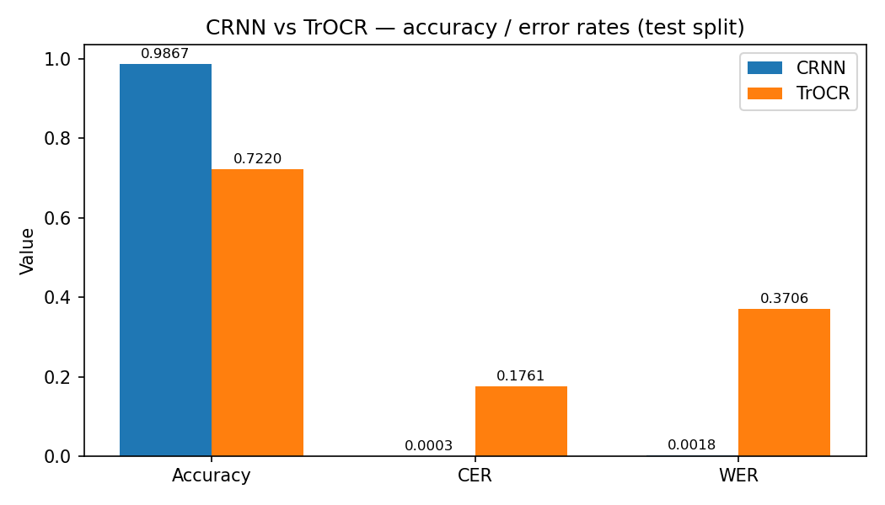
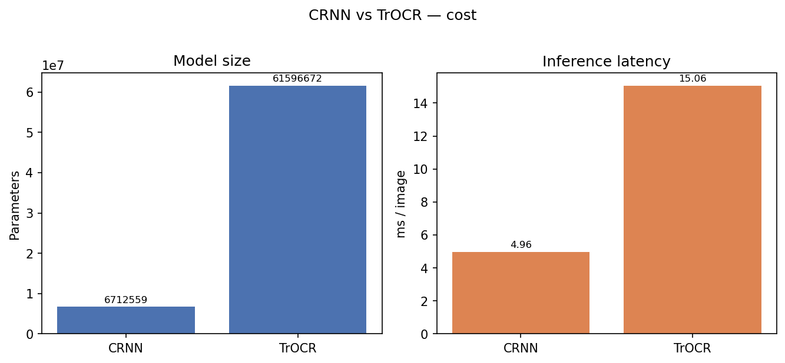

# CRNN vs TrOCR — Comparative Analysis

Devanagari handwritten character recognition, evaluated on the held-out test split (46 balanced classes). Generated by `models/compare.py`.

## Metrics

| Metric | CRNN | TrOCR |
|---|---|---|
| Accuracy | 98.67% | 72.20% |
| CER | 0.0003 | 0.1761 |
| WER | 0.0018 | 0.3706 |
| Parameters | 6,712,559 | 61,596,672 |
| Inference latency | 4.963 ms/img | 15.061 ms/img |
| Test samples | 9,200 | 9,200 |

## Takeaways

- **Accuracy:** CRNN wins (0.9867 vs 0.722).
- **CER:** CRNN wins (0.0003 vs 0.1761).
- **WER:** CRNN wins (0.0018 vs 0.3706).
- **Model size:** CRNN wins (6712559 vs 61596672).
- **Inference latency:** CRNN wins (4.963 vs 15.061).

## Figures

